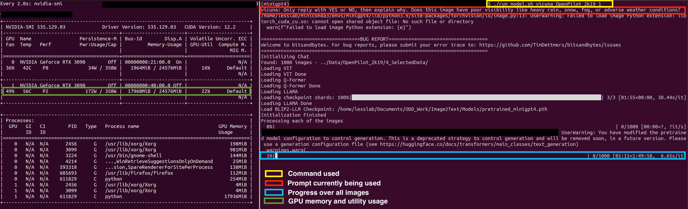

# Setup Documentation

This section contains the setup instructions for the tools used in our study: Openpilot](https://github.com/commaai/openpilot) and [MiniGPT-4](https://github.com/Vision-CAIR/MiniGPT-4). Each folder (`OpenPilot_Setup` and `MiniGPT4_Setup`) includes detailed READMEs to guide you through the setup process.

## Openpilot Setup
- **Purpose:** [Openpilot](https://github.com/commaai/openpilot), our base Driving Automation System is openpilot in the study. Openpilot was fed data the `0_Datasets` folder. The steering angle produced was then used to identify both passing and failing inputs.
- **Setup Instructions:** For detailed setup steps, please refer to the README in the `OpenPilot_Setup` folder.

Here is an example of openpilot whose setup is described in `2023_03` running on data from the comma.ai 2k19 dataset.

## MiniGPT4 Setup
- **Overview:** We used [MiniGPT-4](https://github.com/Vision-CAIR/MiniGPT-4), commit `ef1ac08ce3f2835b3aad09c7e81adea976432062` (was the latest version when we started the study). MiniGPT4 integrates a vision encoder with a pretrained ViT, Q-Former, and advanced Vicuna and Llama 2 language models.
- **Custom Usage:** Our study utilized custom code to process large datasets through MiniGPT4 without the GUI. This code is provided for efficiency and scalability.
- **Setup Instructions:** Follow the standard setup guidelines in the MiniGPT4 [README](https://github.com/Vision-CAIR/MiniGPT-4/blob/main/README.md) and consult our custom instructions for dataset processing in the `MiniGPT_Setup` folder.

## Suggested Hardware Requirements

### MiniGPT 4

MiniGPT 4 was run on a [System 76 Thelio Mega](https://system76.com/desktops/thelio-mega) desktop with Ubuntu 20.04 using Nvidia Driver version (insert)

The desktop has:
* AMD® Ryzen threadripper 3990x 64-core processor 
* 128 GB RAM
* 2 X GeForce RTX 3090 with 24 GB Memory

### Openpilot

Openpilot was run a [MSI GE75 Raider 10SE](https://www.msi.com/Laptop/GE75-Raider-10SE/Specification) laptop with a freshly installed version of Ubuntu 20.04 using the default Nvidia Drivers.

The laptop has:
* 10th Generation i7 - 10750H 
* 16GB Ram
* NVIDIA GeForce RTX™ 2060 with 6GB Memory
