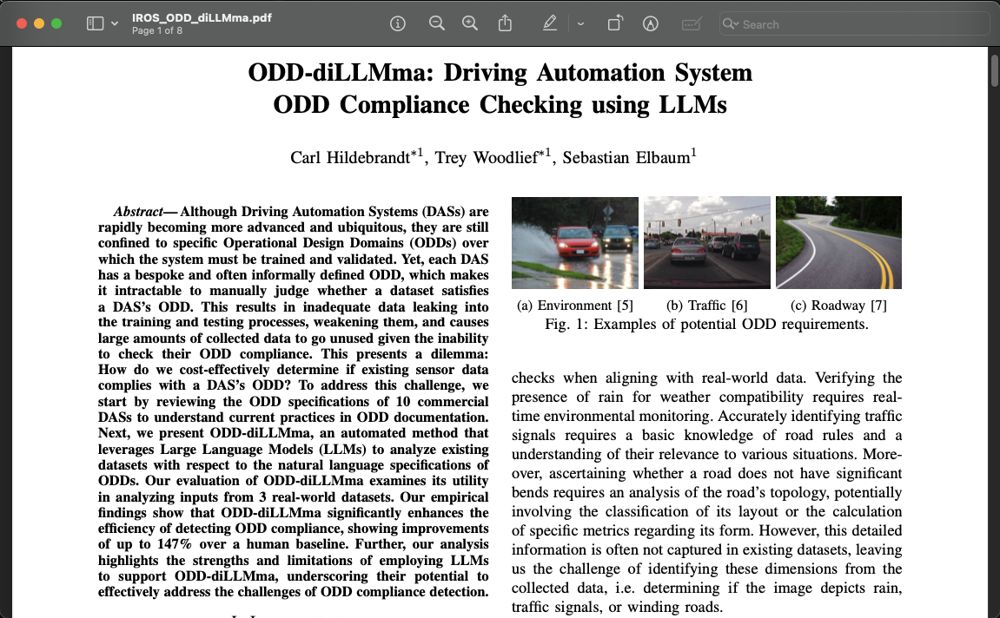

# Research Paper

A copy of the paper can be found by clicking on the image below, or clicking [this](./ODD_diLLMma_Paper.pdf) link.

[](./ODD_diLLMma_Paper.pdf)

## Additional ODD Data

In the paper we state the following:
```txt
We primarily focus on comma.ai’s openpilot ALC DAS and its NL ODD encompassing 11 semantic dimensions [9]; further discussion on the ODD dimensions available in the online repository.
```

### Discussing openpilots 11 semantic dimensions  

comma.ai's OpenPilot's ODD is described on their [website](https://docs.comma.ai/LIMITATIONS.html). A screenshot of data is included in our repo [here](../1_Datasets/ODD/OpenPilot_Limitations/limtations.png), and is shown below:

[](../1_Datasets/ODD/OpenPilot_Limitations/limtations.png)

These were converted to YES or NO questions using as much of the same wording as in the original ODD text. The conversion is shown below:

<div style="overflow-x:auto; margin: 0 auto; width: auto;">
  <table style="border-collapse: collapse; margin: 0 auto;">
    <tr>
      <th style="border: 1px solid black;">Original ODD</th>
      <th style="border: 1px solid black;">Converted ODD</th>
    </tr>
    <tr>
      <td style="border: 1px solid black;">Poor visibility (heavy rain, snow, fog, etc.) or weather conditions that may interfere with sensor operation.</td>
      <td style="border: 1px solid black;">Does this image have poor visibility (heavy rain, snow, fog, etc.) or weather conditions that may interfere with sensor operation? - [YES/NO]</td>
    </tr>
    <tr>
      <td style="border: 1px solid black;">The road facing camera is obstructed, covered or damaged by mud, ice, snow, etc.</td>
      <td style="border: 1px solid black;" rowspan="2">Was the camera that took this image obstructed including by excessive paint or adhesive products (such as wraps, stickers, rubber coating, etc.), covered or damaged by mud, ice, snow, etc? - [YES/NO]</td>
    </tr>
    <tr>
      <td style="border: 1px solid black;">Obstruction caused by applying excessive paint or adhesive products (such as wraps, stickers, rubber coating, etc.) onto the vehicle.</td>
    </tr>
    <tr>
      <td style="border: 1px solid black;">The device is mounted incorrectly.</td>
      <td style="border: 1px solid black;">NA</td>
    </tr>
    <tr>
      <td style="border: 1px solid black;" rowspan="3">When in sharp curves, like on-off ramps, intersections etc…; openpilot is designed to be limited in the amount of steering torque it can produce.</td>
      <td style="border: 1px solid black;">Is the road we are driving on a sharp curve? - [YES/NO]</td>
    </tr>
    <tr>
      <td style="border: 1px solid black;">Is the road we are driving on an on-off ramp? - [YES/NO]</td>
    </tr>
    <tr>
      <td style="border: 1px solid black;">Is the road we are driving on an intersection? - [YES/NO]</td>
    </tr>
    <tr>
    <td style="border: 1px solid black;" rowspan="2">In the presence of restricted lanes or construction zones.</td>
      <td style="border: 1px solid black;">Does the road in this image have restricted lanes? - [YES/NO]</td>
    </tr>
    <tr>
      <td style="border: 1px solid black;">Does the road in this image have construction zones? - [YES/NO]</td>
    </tr>
    <tr>
      <td style="border: 1px solid black;">When driving on highly banked roads or in presence of strong cross-wind.</td>
      <td style="border: 1px solid black;">Is the road we are driving on highly banked?- [YES/NO]</td>
    </tr>
    <tr>
      <td style="border: 1px solid black;">Extremely hot or cold temperatures.</td>
      <td style="border: 1px solid black;">NA</td>
    </tr>
    <tr>
      <td style="border: 1px solid black;">Bright light (due to oncoming headlights, direct sunlight, etc.).</td>
      <td style="border: 1px solid black;">Does this image have bright light (due to oncoming headlights, direct sunlight, etc.)? - [YES/NO]</td>
    </tr>
    <tr>
      <td style="border: 1px solid black;" rowspan="2">Driving on hills, narrow, or winding roads.</td>
      <td style="border: 1px solid black;">Is the road we are driving on narrow or winding? - [YES/NO]</td>
    </tr>
    <tr>
      <td style="border: 1px solid black;">Is the road we are driving on a hill? - [YES/NO]</td>
    </tr>
  </table>
</div>

This resulted in the [Converted ODD](../1_Datasets/ODD/Described_ODD.txt) being as follows:
```
The image is from a front-facing camera in a car. Answer the following questions based on the image provided, using the template below:

Q01: Does this image have poor visibility (heavy rain, snow, fog, etc.) or weather conditions that may interfere with sensor operation? - [YES/NO]
Q02: Was the camera that took this image obstructed including by excessive paint or adhesive products (such as wraps, stickers, rubber coating, etc.), covered or damaged by mud, ice, snow, etc? - [YES/NO]
Q03: Is the road we are driving on a sharp curve? - [YES/NO]
Q04: Is the road we are driving on an on-off ramp? - [YES/NO]
Q05: Is the road we are driving on an intersection? - [YES/NO]
Q06: Does the road in this image have restricted lanes? - [YES/NO]
Q07: Does the road in this image have construction zones? - [YES/NO]
Q08: Is the road we are driving on highly banked?- [YES/NO]
Q09: Does this image have bright light (due to oncoming headlights, direct sunlight, etc.)? - [YES/NO]
Q10: Is the road we are driving on narrow or winding? - [YES/NO]
Q11: Is the road we are driving on a hill? - [YES/NO]
```

## Discussing inconsistencies with the marking

There were many inconsistencies in the original marking of ODD's. This is due to the vague and ambagious wording in the original ODD. For example consider the questions "Is the road we are driving on an intersection? - [YES/NO]". Here are three examples in the `OpenPilot - 2k19` data.


The first image is clearly in an intersection. The second image is about to enter an intersection. The third image is approaching an intersection. Depending on how you define "driving on an intersection" you could argue that the second and third image are either in or out of the ODD. To overcome this and achieve some consistency, the humans came up with a set of rules about answering ODD question. These are as follows:

```
1) Construction:
  * If there is construction anywhere in the image -> mark construction zone.
2) Intersections:
  * Actively entering or actually in an intersection -> mark intersection. Must be able to see something clearly indicating intersection, e.g., sign, road line, traffic light.
  * In or adjacent to a fork in the road -> mark intersection.
  * If we are the second car about to enter the intersection and the car in front of us is over the line, i.e., in the intersection and we are within approximately a car length behind them -> mark as in an intersection.
  * If you might be in an intersection but cannot tell, and your only clue is that you are turning hard -> mark sharp curve.
3) Sharp Curve:
  * Requires a hard turn to stay on the road -> mark sharp curve.
4) Hill:
  * Actively on or entering a hill -> mark hill.
5) Restricted Lane:
  * Restricted road anywhere in the image -> mark restricted lane.
6) On-off Ramp:
  * Actively entering or in an on-off ramp -> mark on-off ramp.
7) Bright Light:
  * "Halo" or other image artifact from on-coming headlight or sun -> mark bright light.
  * If you can't see the road, it can't be marked as sharp curve, on-off ramp, intersection.
8) Image Obstructed:
  * The car itself is obstructing it, e.g., the windshield glare or windshield wiper -> mark image obstructed.
```
