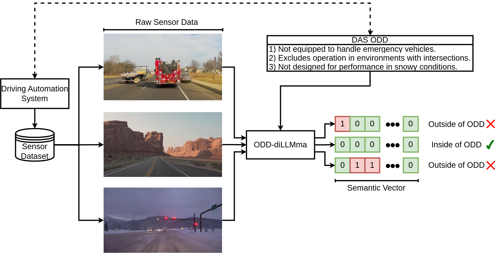
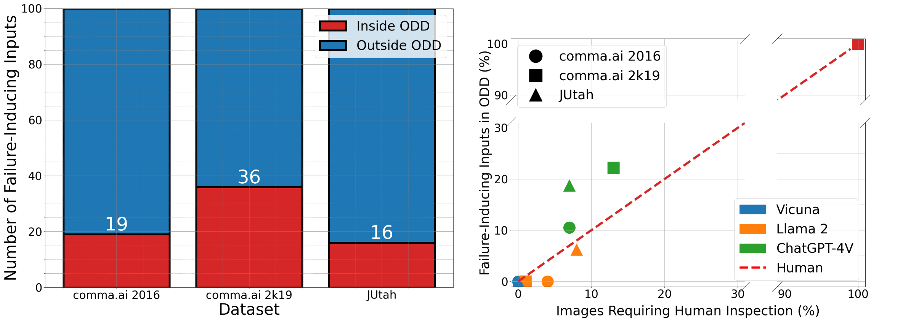
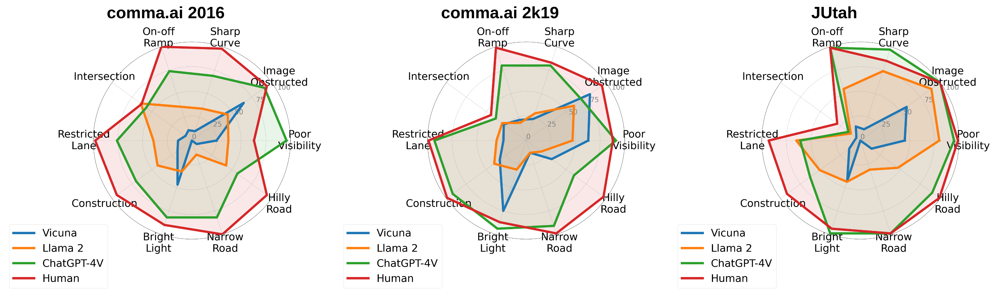
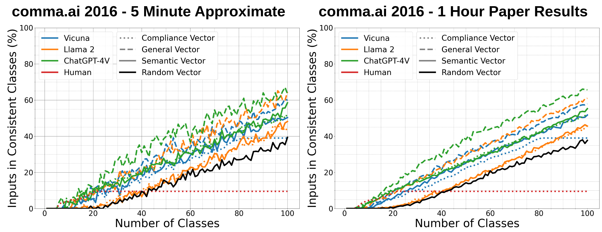

# ODD-diLLMma: Leveraging LLMs for Test Suite Analysis and Comparison with Debugging Support

Although driving automation systems (DASs) are rapidly becoming more advanced and ubiquitous, they are still confined to specific operational design domains (ODDs) over which the system must be  trained and validated. Yet, each DAS has a bespoke ODD, rendering the data used to train and validate one system potentially inapplicable to another. A compounding complication is that such ODDs are typically described in natural language and are incomplete and ambiguous.   These discrepancies lock away large amounts of existing data that has been collected but for which it is intractable to manually judge whether it satisfies a DAS's ODD, or worse, they cause for inadequate data to leak into the training and testing process. This presents our central dilemma: How do we cost-effectively determine if existing sensor data complies with a DAS's ODD? To address this challenge, we present ODD-diLLMma, an automated method that leverages  LLMs to analyze existing datasets with respect to the natural language specification of ODDs. We examine the utility of this approach to evaluate, compare, and cluster inputs from 3 datasets as per the ODD of comma.ai openpilot. Our empirical findings point to the strengths and weaknesses of LLMs to support ODD-diLLMma and their potential to address this challenge.



## Prerequisites

This software was run on Ubuntu 20.04. We require you to have [conda](https://docs.conda.io/en/latest/) installed. Once [conda](https://docs.conda.io/en/latest/) is installed you can create the conda environment required for this using:

```bash
conda create --name ODD --file requirements.txt
```

## Quick Start: Reproducing Results

To quickly reproduce the results in the paper please refer to the `3_GenerateResults` [README](./3_GenerateResults/README.md)

### RQ1 - Failures within the ODD

First it presents the command used to generate the results from RQ1:



And how these can be used to select the failures within the ODD presented in the paper.


### RQ2 - Compliance and Violation of ODD

Next it describes how to generate the results from RQ2, for example the semantics from the failing tests from each dataset.



As well as the results presented in the text:

```bash
Model: Vicuna agreement with human
	comma.ai 2016: 20.30%
	comma.ai 2k19: 28.90%
	JUtah: 27.40%
	Average: 25.53%
Model: Llama2 agreement with human
	comma.ai 2016: 43.80%
	comma.ai 2k19: 26.30%
	JUtah: 59.30%
	Average: 43.13%
Model: ChatGPT-4V agreement with human
	comma.ai 2016: 83.30%
	comma.ai 2k19: 88.10%
	JUtah: 87.10%
	Average: 86.17%
```

### RQ3 - Grouping inputs by ODD semantics

Finally it will show you how to both run quick approximations of the results in RQ3, as well as the full results presented in the paper (_NOTE_: these results take up to an hour to generate_):




## Quick Start: Running OpenPilot and MiniGPT

This repository also describes how the data was generated. If you want to generate your own data you can follow the [0_SetupDocumentation](./0_SetupDocumentation/README.md)/. However please note setting this up requires significantly more time than just reproducing the results from the data provided in this repository.

### Openpilot

This [README](./0_SetupDocumentation/OpenPilot_Setup/README.md) describes how to set up two versions of [Openpilot](https://github.com/commaai/openpilot), and run it on video data as shown below: 


### MiniGPT-4

This [README](./0_SetupDocumentation/OpenPilot_Setup/README.md) describes how to set up [MiniGPT4](https://github.com/Vision-CAIR/MiniGPT-4), and run it on large volumes of image data as it can be seen doing below:


## Repository Structure

This repository is organized into several folders, each serving a specific purpose in our study. Below is a table detailing each folder, its contents, and a link to the corresponding ReadMe for more in-depth information.

| Folder Name            | Description                                                                                                  | README Link 								  |
|------------------------|--------------------------------------------------------------------------------------------------------------|---------------------------------------------|
| `0_SetupDocumentation` | Guides for setting up local LLM models and OpenPilot 														| [README](./0_SetupDocumentation/README.md)  |
| `0_Datasets`           | Contains three datasets with openpilot steering data and scenario descriptions by three LLMs and humans. 	| [README](./1_Datasets/README.md) 			  |
| `1_ProcessData`        | Code for data conversion to openpilot formats and data subset selection based on openpilot steering data. 	| [README](./1_ProcessDataset/README.md) 	  |
| `2_GenerateCaption`    | Code for caption generation using Vicuna, Llama, ChatGPT, and human benchmarking. 							| [README](./2_GenerateCaption/README.md)  	  |
| `3_GenerateResults`    | Code for analyzing study results and data presentation. Key to understanding study outcomes. 				| [README](./3_GenerateResults/README.md) 	  |

Please refer to the individual ReadMe files in each folder for detailed information about the contents and their usage.

## Contact

Please feel free to reach out to todo@todo.edu for any questions