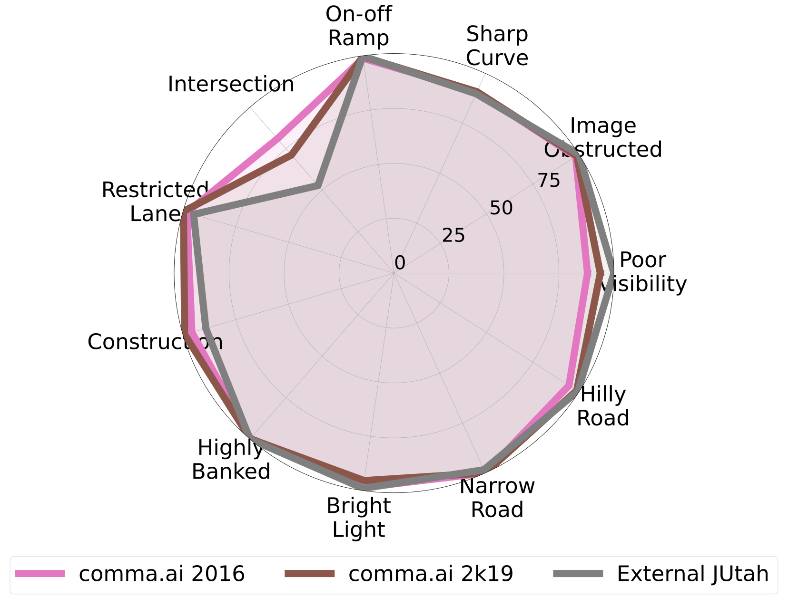
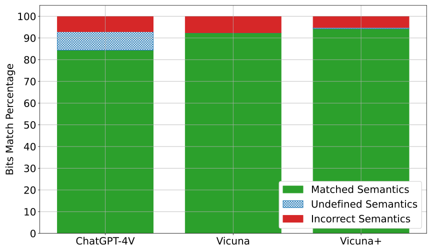

# ODD-diLLMma: Driving Automation System ODD Compliance Checking using LLMs

In the evolving landscape of Driving Automation Systems (DASs), the alignment of sensor data with Operational Design Domains (ODDs) presents a significant challenge due to the varied and often informally specified nature of ODDs. ODD-diLLMma represents the first automated solution leveraging Large Language Models (LLMs) to systematically assess and confirm the ODD compliance of sensor data based on natural language ODD specifications. This is the first attempt at an automated approach which demonstrates efficiency improvements of up to 147% faster compliance checking compared to manual methods. This repository houses the dataset and implementation details of ODD-diLLMma as used in our research.


---
---

## Research Paper

A copy of the paper can be found by clicking on the image below, or clicking [this](./PaperArtifact/ODD_diLLMma_Paper.pdf) link.

[](./PaperArtifact/ODD_diLLMma_Paper.pdf)

### Artifact Data

Additionally all additional data analysis not shown in the paper can be found [here](./PaperArtifact).

---
---

## Prerequisites

### Software

This software was primarily run on Ubuntu 20.04. However generating all the study graphs is not tied to any specific operating system and has also been reproduced on MacOS. We require you to have [conda](https://docs.conda.io/en/latest/) installed. Once [conda](https://docs.conda.io/en/latest/) is installed you can create the conda environment required for this using:

```bash
conda env create -f environment.yml -n ODD
``` 

You will also need to have [7-Zip](https://7-zip.org) installed. To install it you can do the following:

MacOS:
```bash
brew update
brew install p7zip
```

Ubuntu:
```bash
sudo apt install p7zip-full p7zip-rar
```

### Data

The entire set of data we used in this paper totals `937GB`. To download it and fully replicate it please see the dataset [README](./1_Datasets/README.md).

**However:** We have provided a Zonodo link containing all the data required to replicate the result in this paper (`3GB` total). This includes:

* The 1500 selected passing and failing images located in `1_Datasets/Data/<DatasetName>/4_SelectedData/`
* The Human and LLM ODD descriptions located in `1_Datasets/Data/<DatasetName>/5_Descriptions/`

You can download this data by running the following script.
```bash
source download_partial_dataset.sh
```

---
---

## Quick Start: Reproducing Results

A full description on how to reproduce the results in the paper is described in  `5_GenerateResults` [README](./5_GenerateResults/README.md). However to quickly get started, please see below (Make sure you have downloaded the partial dataset descried above.):

### Human Study

Navigate to `5_GenerateResults`, and run the following command:

```bash
python3 S2_Pass_Fail_Compliance.py --annotator Human --dataset_directory "../1_Datasets/Data"
```

This will generate the table shown in Figure 2 in the paper. This table shows the compliance of each of the datasets according to human annotation.

```bash
+----------------+----------------+--------------+---------------+
| Dataset Filter | Dataset Name   | In ODD Count | Out ODD Count |
+----------------+----------------+--------------+---------------+
| Full Dataset   | OpenPilot 2016 |          268 |           232 |
+----------------+----------------+--------------+---------------+
| Full Dataset   | OpenPilot 2k19 |          288 |           212 |
+----------------+----------------+--------------+---------------+
| Full Dataset   | External Jutah |          183 |           317 |
+----------------+----------------+--------------+---------------+
| Failing Data   | OpenPilot 2016 |           77 |           173 |
+----------------+----------------+--------------+---------------+
| Failing Data   | OpenPilot 2k19 |           66 |           184 |
+----------------+----------------+--------------+---------------+
| Failing Data   | External Jutah |           46 |           204 |
+----------------+----------------+--------------+---------------+
| Passing Data   | OpenPilot 2016 |          191 |            59 |
+----------------+----------------+--------------+---------------+
| Passing Data   | OpenPilot 2k19 |          222 |            28 |
+----------------+----------------+--------------+---------------+
| Passing Data   | External Jutah |          137 |           113 |
+----------------+----------------+--------------+---------------+
```

Next you can run the following command:

```bash
python3 S2_Dimension_Compliance.py --annotator Human --description_filter Both --dataset_directory "../1_Datasets/Data"
```

This will generate Figure 2 from the paper. This figure shows the compliance per semantic dimension according to the human annotation.



```bash
python3 S2_Pass_Fail_Compliance.py --annotator Human --dataset_directory "../1_Datasets/Data"
```


### RQ1 -- Detecting in-ODD failures

Navigate to `5_GenerateResults`, and run the following command:

```bash
python3 RQ1_Human_Inspection.py --dataset_directory "../1_Datasets/Data"
```

This will generate Figure 6 from the paper. This figure shows the percentage of in-ODD failures found versus the number of images that would require human inspection.


Next you can run the following command:

```bash
python3 RQ1_Inspect_Images_In_ODD.py --annotator ChatGPT_Base --description_filter Fail --dataset External_Jutah --resize_display "(640,480)" --filter_human_verified_odd --dataset_directory "../1_Datasets/Data"
```

This would show you each of the failures `ChatGPT` found that were in ODD for the `External_Jutah` datasets as verified by the human. For example when you run this command you will see the first image listed under `External_Jutah` for `ChatGPT` in Figure 5.


### RQ2 - Compliance Prediction Accuracy

Navigate to `5_GenerateResults`, and run the following command:

```bash
python3 RQ2_ODD_Vector_Comparison.py --description_filter Both --dataset_directory "../1_Datasets/Data"
```

This will produce both Figure 7 and Figure 8 from the paper. Figure 7 represents the accuracy by the LLM in predicting in-ODD and out-ODD images.


Figure 8 represents the accuracy by the LLM per each of the semantic dimensions.



Finally you can run the following command:

```bash
python3 RQ2_ODD_Dimension_Comparison.py --description_filter Both --dataset_directory "../1_Datasets/Data"
```

This will generate Figure 9 from the paper. This is the accuracy per semantic dimension represented as a radar plot.


## Quick Start: Running OpenPilot and MiniGPT

This repository also describes how the data was generated. If you want to generate your own data you can follow the [0_SetupDocumentation](./0_SetupDocumentation/README.md)/. However please note setting this up requires significantly more time than just reproducing the results from the data provided in this repository.

### Openpilot

This [README](./0_SetupDocumentation/OpenPilot_Setup/README.md) describes how to set up three versions of [Openpilot](https://github.com/commaai/openpilot). Below is an example of a video running on one of the versions of OpenPilot.


### MiniGPT-4

This [README](./0_SetupDocumentation/OpenPilot_Setup/README.md) describes how to set up [MiniGPT4](https://github.com/Vision-CAIR/MiniGPT-4), and run it on large volumes of image data as it can be seen doing below:


## Repository Structure

This repository is organized into several folders, each serving a specific purpose in our study. Below is a table detailing each folder, its contents, and a link to the corresponding ReadMe for more in-depth information.

| Folder Name             | Description                                                                                                  | README Link 								  |
|-------------------------|--------------------------------------------------------------------------------------------------------------|--------------------------------------------|
| `0_SetupDocumentation`  | Guides for setting up local LLM models and OpenPilot 														| [README](./0_SetupDocumentation/README.md)  |
| `1_Datasets`            | Contains three datasets with openpilot steering data and scenario descriptions by three LLMs and humans. 	| [README](./1_Datasets/README.md) 			  |
| `2_TransformVideos`     | Code for data conversion to openpilot formats. 																| [README](./2_TransformVideos/README.md) 	  |
| `3_Oracle`    		  | Code used to select passing and failing data from the steering angles. 									    | [README](./3_Oracle/README.md)  	  		  |
| `4_GenerateDescriptions`| Code for generating descriptions using Vicuna, ChatGPT, and human benchmarking. 							| [README](./2_GenerateCaption/README.md)  	  |
| `5_GenerateResults`     | Code for analyzing study results and data presentation. Key to understanding study outcomes. 				| [README](./5_GenerateResults/README.md) 	  |

Please refer to the individual ReadMe files in each folder for detailed information about the contents and their usage.

## Contact

Please feel free to reach out to `hildebrandt.carl@virginia.edu` or `adw8dm@virginia.edu` for any questions